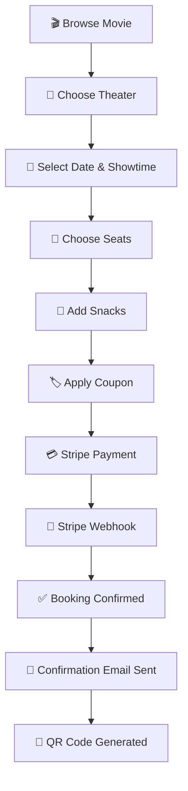
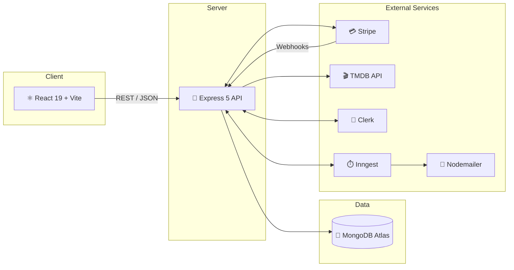
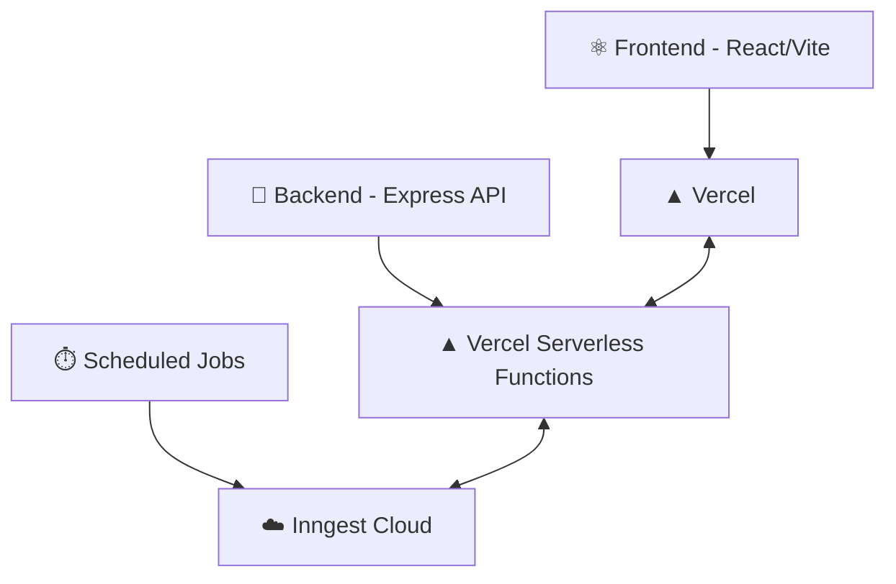

<div align="center">

# 🎬 MovieTix

### A modern, full-stack movie ticket booking platform — from seat selection to Stripe checkout, community screenings to dynamic pricing.

[](https://react.dev/)
[](https://nodejs.org/)
[](https://expressjs.com/)
[](https://www.mongodb.com/atlas)
[](https://stripe.com/)
[](https://clerk.com/)
[](https://www.themoviedb.org/)
[](LICENSE)

[](https://github.com/VKGarg7/MovieTix/stargazers)
[](https://github.com/VKGarg7/MovieTix/network/members)
[](https://github.com/VKGarg7/MovieTix/commits)
[](https://movietix-rho.vercel.app/)

**[🚀 Live Demo](https://movietix-rho.vercel.app/)** &nbsp;•&nbsp;
**[📂 Repository](https://github.com/VKGarg7/MovieTix)** &nbsp;•&nbsp;
**[💼 LinkedIn](https://www.linkedin.com/in/vansh-garg-bb5060202/)** &nbsp;•&nbsp;
**[📧 Email](mailto:14garg04@gmail.com)**

</div>

<br />

<div align="center">
  
  <p><em>Modern Full-Stack Movie Ticket Booking Platform</em></p>
</div>

<br />

> [!NOTE]
> Screenshots and the banner above are placeholders (`assets/*.png`). Drop your own images into an `assets/` folder at the repo root and they'll render automatically on GitHub.

---

## 📖 Table of Contents

<details>
<summary>Click to expand</summary>

- [About](#-about)
- [Feature Showcase](#-feature-showcase)
- [Application Screenshots](#-application-screenshots)
- [Booking Flow](#-booking-flow)
- [System Architecture](#-system-architecture)
- [Tech Stack](#-tech-stack)
- [Project Structure](#-project-structure)
- [Installation](#-installation)
- [Environment Variables](#-environment-variables)
- [API Documentation](#-api-documentation)
- [Admin Features](#-admin-features)
- [User Features](#-user-features)
- [Performance](#-performance)
- [Security](#-security)
- [Deployment](#-deployment)
- [Roadmap](#-roadmap)
- [Contributing](#-contributing)
- [Contact](#-contact)
- [Support](#-support)
- [License](#-license)

</details>

---

## 🧭 About

**MovieTix** is a production-grade movie ticket booking platform built to simulate — and go beyond — how real-world cinema chains run their online booking, pricing, and community engagement systems.

| Pillar | What it means |
|---|---|
| 🎟️ **User Experience** | Browse now-playing movies (TMDB-powered), pick a theater, choose seats on an interactive map, and check out in seconds. |
| 🛠️ **Admin Dashboard** | A role-protected control center for revenue analytics, show/theater management, coupons, pricing rules, and audit trails. |
| ⚡ **Booking Flow** | Real-time seat locking, automatic release of unpaid holds, group bookings, waitlists, and price-drop watches. |
| 🔔 **Real-Time Features** | Live seat availability, showtime polls, trailer votes, and Inngest-scheduled reminders. |
| 💳 **Secure Payments** | Stripe Checkout Sessions with webhook-verified confirmation — covers tickets, gift cards, resale, and subscriptions. |
| 🔐 **Authentication** | Clerk-powered sign-up/sign-in with session sync to MongoDB and role-based access (user / theater-admin / super-admin). |

---

## ✨ Feature Showcase

| Feature | Description |
|---|---|
| 🔐 **Authentication** | Secure Clerk auth with session management and MongoDB user sync via Inngest webhooks |
| 💺 **Seat Booking** | Interactive seat map with real-time occupancy and auto-release of unpaid holds after 10 minutes |
| 💳 **Stripe Payments** | Checkout Sessions with signature-verified webhook confirmation |
| 🖥️ **Admin Dashboard** | Revenue analytics, occupancy pulse, CSV export, and full show/booking management |
| 📧 **Email Notifications** | Booking confirmations, new-show alerts, and pre-show reminders (Nodemailer + Inngest cron) |
| 🎬 **Movie Discovery** | Live TMDB integration — now-playing titles, posters, cast, and trailers |
| 🎉 **Group Bookings** | Coordinate multi-person bookings for a single showtime |
| 🎁 **Gift Cards** | Purchase and redeem monetary gift cards via Stripe checkout |
| 🔁 **Ticket Transfer & Resale** | Send a ticket to a friend or resell it (capped at original price) |
| ⭐ **Loyalty & Referrals** | Points-transaction ledger with referral rewards |
| 🍿 **Binge Pass Membership** | Recurring subscription plan with usage tracking |
| 🍟 **Concessions Ordering** | Add theater menu items (snacks & drinks) to a booking |
| 📊 **Dynamic Pricing** | Configurable pricing rules applied automatically at showtime |
| 🏷️ **Coupons** | Admin-managed discount codes at checkout |
| 📜 **Audit Logs** | Immutable trail of sensitive admin actions |
| 📱 **QR Verification** | HMAC-signed QR codes for in-theater concession pickup |
| 🗳️ **Showtime Polls & Trailer Votes** | Community-driven scheduling and trailer sentiment |
| 🎪 **Community Screenings** | Verified hosts request off-peak slots; admin approval creates a bookable show with revenue split |
| ⏰ **Waitlist & Price Watch** | Get notified when a sold-out show frees up or a price drops |
| 🧭 **Leave-Now Reminders** | Pre-show notifications that factor in travel time |

---

## 🖼️ Application Screenshots

<details open>
<summary><strong>🏠 Home Page</strong></summary>
<br />

</details>

<details>
<summary><strong>🎞️ Movie Details</strong></summary>
<br />

</details>

<details>
<summary><strong>🎟️ Booking Flow</strong></summary>
<br />

</details>

<details>
<summary><strong>💺 Seat Selection</strong></summary>
<br />

</details>

<details>
<summary><strong>💳 Checkout</strong></summary>
<br />

</details>

<details>
<summary><strong>🖥️ Admin Dashboard</strong></summary>
<br />

</details>

<details>
<summary><strong>📊 Analytics</strong></summary>
<br />

</details>

<details>
<summary><strong>📱 Mobile View</strong></summary>
<br />

</details>

---

## 🔄 Booking Flow



---

## 🏗️ System Architecture



---

## 🛠️ Tech Stack

<table>
<tr>
<td valign="top" width="33%">

**Frontend**
- React 19 + Vite
- Tailwind CSS 4
- React Router 7
- Context API
- Framer Motion
- React Three Fiber / Drei
- Leaflet / React-Leaflet
- Recharts
- html5-qrcode

</td>
<td valign="top" width="33%">

**Backend**
- Node.js
- Express 5
- Inngest (cron & webhooks)
- Nodemailer
- Swagger UI / OpenAPI
- express-rate-limit
- Luxon

</td>
<td valign="top" width="33%">

**Database**
- MongoDB Atlas
- Mongoose ODM

</td>
</tr>
<tr>
<td valign="top">

**Authentication**
- Clerk (sign-up/sign-in, sessions)
- Role-based access (user / theater-admin / super-admin)

</td>
<td valign="top">

**Payments**
- Stripe Checkout Sessions
- Signature-verified webhooks
- Gift cards, resale & subscriptions

</td>
<td valign="top">

**Background Jobs**
- Inngest scheduled functions
- Unpaid-booking release
- Reminder & digest emails

</td>
</tr>
<tr>
<td valign="top">

**Deployment**
- Vercel (frontend)
- Vercel Serverless (backend)
- Inngest Cloud (jobs)

</td>
<td valign="top">

**External APIs**
- TMDB (movie metadata)
- Cloudinary (media)

</td>
<td valign="top">

**Developer Tools**
- ESLint
- Vitest
- Swagger/OpenAPI docs
- Accessibility (a11y) checker

</td>
</tr>
</table>

---

## 📁 Project Structure

```text
MovieTix/
├── client/                        # React 19 + Vite frontend
│   ├── src/
│   │   ├── components/            # Reusable UI components
│   │   ├── pages/                 # Route-level pages
│   │   ├── context/                # Global app/auth state (Context API)
│   │   ├── hooks/                    (colocated within components/pages)
│   │   └── main.jsx
│   ├── public/
│   └── vite.config.js
│
└── server/                        # Express 5 backend
    ├── controllers/                # Business logic per feature
    ├── routes/                     # Express routers (mounted in server.js)
    ├── models/                     # Mongoose schemas
    ├── middleware/                 # Auth, rate-limiting, error handling
    ├── inngest/                    # Scheduled/background job definitions
    ├── configs/                    # DB, logger, mailer, Swagger config
    ├── utils/                      # QR tokens, loyalty points, referrals, etc.
    ├── scripts/                    # Seed & doc-generation scripts
    ├── test/                       # Vitest test suites
    └── server.js                   # App entrypoint & route mounting
```

---

## ⚙️ Installation

### 1️⃣ Clone the Repository

```bash
git clone https://github.com/VKGarg7/MovieTix.git
cd MovieTix
```

### 2️⃣ Install & Run the Backend

```bash
cd server
npm install
npm run server
```

### 3️⃣ Install & Run the Frontend

```bash
cd client
npm install
npm run dev
```

### 4️⃣ (Optional) Seed Sample Data

```bash
cd server
npm run seed:theaters   # sample theaters/screens
npm run seed:movies     # sample movies pulled from TMDB
```

> [!TIP]
> Once the backend is running, interactive API docs are live at **`http://localhost:3000/api/docs`**.

### 🧪 Testing & Linting

```bash
# Backend
cd server
npm run lint
npm test

# Frontend
cd client
npm run lint
npm run a11y-check
```

---

## 🔐 Environment Variables

Copy `server/.env.example` → `server/.env` and `client/.env.example` → `client/.env`, then fill in the values below.

### Backend (`server/.env`)

| Variable | Required | Description | Example |
|---|:---:|---|---|
| `MONGODB_URI` | ✅ | MongoDB connection string | `mongodb+srv://...` |
| `PORT` | ➖ | Port the Express server listens on | `3000` |
| `CORS_ORIGIN` | ✅ | Comma-separated allowed origins | `http://localhost:5173` |
| `CLERK_PUBLISHABLE_KEY` | ✅ | Clerk publishable key | `pk_test_...` |
| `CLERK_SECRET_KEY` | ✅ | Clerk secret key | `sk_test_...` |
| `INNGEST_EVENT_KEY` | ✅ | Inngest event key | `...` |
| `INNGEST_SIGNING_KEY` | ✅ | Inngest signing key | `signkey-...` |
| `TMDB_API_KEY` | ✅ | TMDB v4 read access token | `eyJhbGciOi...` |
| `STRIPE_SECRET_KEY` | ✅ | Stripe secret key | `sk_test_...` |
| `STRIPE_WEBHOOK_SECRET` | ✅ | Stripe webhook signing secret | `whsec_...` |
| `STRIPE_BINGE_PASS_PRICE_ID` | ✅ | Stripe recurring Price ID for the Binge Pass membership | `price_...` |
| `GMAIL_USER` | ✅ | Gmail address used to send emails | `you@gmail.com` |
| `GMAIL_PASS` | ✅ | Gmail app password | `abcd efgh ijkl mnop` |
| `QR_TOKEN_SECRET` | ✅ | HMAC secret for signing concession pickup QR tokens | `super-secret-string` |
| `LOG_LEVEL` | ➖ | Logging verbosity | `info` |
| `RATE_LIMIT_PUBLIC_WINDOW_MIN` | ➖ | Window (minutes) for public rate limiting | `1` |
| `RATE_LIMIT_PUBLIC_MAX` | ➖ | Max public requests per window | `60` |
| `RATE_LIMIT_SEATS_WINDOW_MIN` | ➖ | Window (minutes) for seat-polling rate limiting | `1` |
| `RATE_LIMIT_SEATS_MAX` | ➖ | Max seat-polling requests per window | `30` |
| `RATE_LIMIT_ALLOWLIST` | ➖ | Comma-separated IPs exempt from rate limits | `203.0.113.4` |

### Frontend (`client/.env`)

| Variable | Required | Description | Example |
|---|:---:|---|---|
| `VITE_CLERK_PUBLISHABLE_KEY` | ✅ | Clerk publishable key (client-safe) | `pk_test_...` |
| `VITE_BASE_URL` | ✅ | Base URL of the backend API | `http://localhost:3000` |
| `VITE_CURRENCY` | ➖ | Currency symbol shown in the UI | `$` |
| `VITE_TMDB_IMAGE_BASE_URL` | ➖ | Base URL for TMDB poster/backdrop images | `https://image.tmdb.org/t/p/w500` |

---

## 📚 API Documentation

> Full interactive OpenAPI/Swagger docs are auto-generated and served at **`/api/docs`** once the server is running. The table below is a high-level index of feature modules — see `server/server.js` for the full mount list.

| Method(s) | Base Path | Description |
|---|---|---|
| `GET` | `/api/show` | Movies & showtimes |
| `POST/GET` | `/api/booking` | Seat booking & checkout |
| `POST/GET` | `/api/group-booking` | Group bookings |
| `POST/GET` | `/api/showtime-poll` | Showtime voting polls |
| `POST/GET` | `/api/price-watch` | Price drop alerts |
| `POST/GET` | `/api/waitlist` | Sold-out show waitlists |
| `GET` | `/api/admin/dashboard-data` | Admin dashboard summary |
| `GET` | `/api/admin/dashboard-analytics` | Revenue & occupancy analytics |
| `GET` | `/api/admin/export-bookings` | CSV export of bookings |
| `GET` | `/api/admin/audit-log` | Super-admin audit trail |
| `GET/POST` | `/api/user` | User profile & account |
| `GET/POST` | `/api/theater` | Theater management |
| `GET/POST` | `/api/screen` | Screen management |
| `POST/GET` | `/api/review` | Movie/show reviews |
| `GET` | `/api/recommendations` | Personalized recommendations |
| `POST/GET` | `/api/coupon` | Discount coupons |
| `POST/GET` | `/api/pricing-rule` | Dynamic pricing rules |
| `GET/POST` | `/api/menu` | Theater concessions/menu |
| `POST/GET` | `/api/subscription` | Binge Pass membership |
| `POST/GET` | `/api/gift-card` | Gift card purchase & redemption |
| `POST/GET` | `/api/ticket-transfer` | Direct ticket transfer & resale |
| `POST/GET` | `/api/community-host` | Community host verification |
| `POST/GET` | `/api/community-screening` | Community screening slots & requests |
| `POST/GET` | `/api/emotional-pulse` | Post-show emotional reaction tagging |
| `GET` | `/api/leave-now-reminder` | Pre-show travel-time reminders |
| `POST/GET` | `/api/trailer-vote` | Trailer voting |
| `POST` | `/api/stripe` | Stripe webhook receiver |
| `ALL` | `/api/inngest` | Inngest background job endpoint |
| `GET` | `/api/docs` | Swagger/OpenAPI documentation UI |

---

## 🖥️ Admin Features

| 📊 Dashboard | 💰 Revenue Analytics | 🎬 Shows |
|---|---|---|
| Live overview of bookings, shows & revenue | Occupancy pulse, trends, CSV export | Create/manage shows from live TMDB data |

| 🏢 Theaters & Screens | 🏷️ Coupons | 📈 Pricing Rules |
|---|---|---|
| Multi-theater, multi-screen management | Create & manage discount codes | Configure demand/time-based dynamic pricing |

| 📜 Audit Logs | 📱 QR Verification | 🍿 Concessions |
|---|---|---|
| Track sensitive admin actions | Verify HMAC-signed pickup codes in-theater | Manage snack/drink menu items |

| 🗂️ Bookings Management | | |
|---|---|---|
| View, filter, and export all bookings | | |

## 🙋 User Features

| 🔍 Movie Search | ❤️ Wishlist | 🎟️ Booking & Seats |
|---|---|---|
| Discover now-playing titles via TMDB | Save movies for later | Interactive real-time seat map |

| ⭐ Reviews & Ratings | 🗳️ Trailer Votes & Polls | 🔔 Notifications |
|---|---|---|
| Share and browse user reviews | Vote on trailers & showtime options | Email reminders & price-drop alerts |

| 🏅 Loyalty & Referrals | 🍿 Binge Pass Membership | 🍟 Food Ordering |
|---|---|---|
| Earn points, invite friends | Recurring subscription perks | Add snacks/drinks to a booking |

| 💳 Payments | 🎁 Gift Cards | 🔁 Ticket Transfer/Resale |
|---|---|---|
| Secure Stripe checkout | Purchase & redeem for friends | Send or resell a ticket |

---

## ⚡ Performance

- 🖼️ **Optimized Images** — TMDB `w500` posters by default, full-res on demand
- 💤 **Lazy Loading** — route-level code splitting in the React app
- ☁️ **Serverless APIs** — backend deployed as Vercel serverless functions
- 📱 **Responsive Design** — mobile-first Tailwind layouts across the app
- 🔒 **Protected Routes** — role-gated frontend routes and backend middleware
- ⚙️ **Caching** — client-side data caching via Context API

## 🔒 Security

- 🔑 **Clerk Authentication** — managed sessions, no custom password storage
- 🪪 **Role-Based Access Control** — user / theater-admin / super-admin scoping
- ✅ **Webhook Signature Verification** — Stripe webhooks verified before processing
- 🧪 **Input Validation** — request payload validation at every controller boundary
- 🚦 **Rate Limiting** — per-route limiters (public traffic, seat polling, status polling) with IP allowlisting
- 💳 **Secure Payments** — no card data ever touches the server (Stripe Checkout)
- 📱 **HMAC-Signed QR Tokens** — tamper-proof concession pickup codes
- 📜 **Audit Logging** — immutable trail of sensitive admin actions

---

## 🚀 Deployment



| Layer | Platform |
|---|---|
| Frontend | Vercel |
| Backend | Vercel (serverless, `server/vercel.json`) |
| Background jobs | Inngest Cloud |

---

## 🗺️ Roadmap

- [ ] 📱 Native mobile app (React Native)
- [ ] 🤖 AI-powered movie recommendations
- [ ] 💬 In-app support chatbot
- [ ] 🌐 Multi-language support (i18n)
- [ ] 👛 In-app wallet & stored balance
- [ ] 🔑 Social login providers (Google, Apple)
- [ ] 🎞️ Expanded gift card catalog & bundles

> Have an idea? [Open a feature request](https://github.com/VKGarg7/MovieTix/issues/new).

---

## 🤝 Contributing

Contributions are what make the open-source community amazing. Any contribution you make is **greatly appreciated**.

1. **Fork** the repository
2. **Create your branch**
   ```bash
   git checkout -b feature/amazing-feature
   ```
3. **Commit your changes**
   ```bash
   git commit -m "feat: add amazing feature"
   ```
4. **Push to your branch**
   ```bash
   git push origin feature/amazing-feature
   ```
5. **Open a Pull Request**

> [!TIP]
> Run `npm run lint` and `npm test` in `server/` (and `npm run lint` in `client/`) before opening a PR.

---

## 📬 Contact

<div align="center">

### Vansh Garg

[](https://github.com/VKGarg7)
[](https://www.linkedin.com/in/vansh-garg-bb5060202/)
[](mailto:14garg04@gmail.com)

</div>

---

## 💖 Support

If this project helped you or impressed you, consider:

⭐ **[Star the repo](https://github.com/VKGarg7/MovieTix)** &nbsp;•&nbsp;
🍴 **[Fork it](https://github.com/VKGarg7/MovieTix/fork)** &nbsp;•&nbsp;
🐛 **[Report a bug](https://github.com/VKGarg7/MovieTix/issues/new)** &nbsp;•&nbsp;
💡 **[Suggest a feature](https://github.com/VKGarg7/MovieTix/issues/new)**

---

## 📄 License

This project is licensed under the **MIT License** — see the [LICENSE](LICENSE) file for details.

<div align="center">
<sub>Built with ❤️ by <a href="https://github.com/VKGarg7">Vansh Garg</a></sub>
</div>
